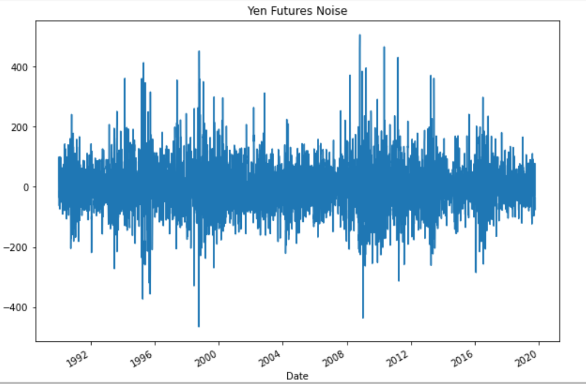
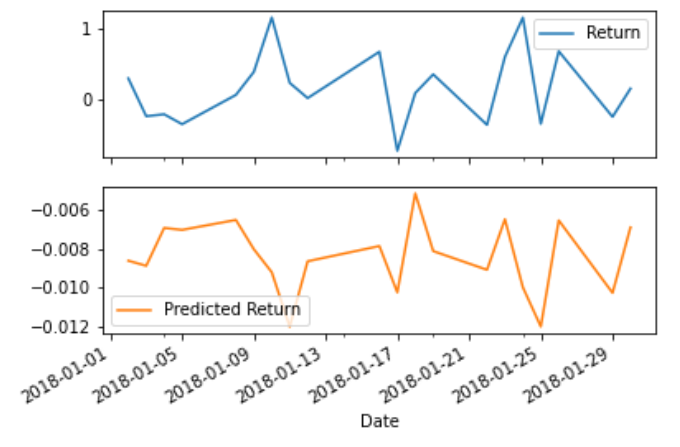

## Time Series Notebook Analysis

### Initial Time Series Plotting
The initial plot of settle prices was first done to see if 
any trends can be identified.  Based on initial analysis, it seems there
could be a trend in both the short term and long term.  Significant 
spikes can be noticed around 1995 and 2012-2013.  Based on these trends
it is possible a smaller peak will occur in approximately the next 
2-4 years, followed by a smaller downward trend 3-4 years after that. 
As for longer term, another sizeable peak may occur around 2036 - 2037, 
similar to the larger peaks that occurred in 1995 and 2012-2013. 

The initial time series data was further sliced into 
different data ranges and month/week data to look for seasonality. There
does seem to be some seasonality in the data.  For example, when sliced
monthly from 2016-2019 a spike generally occurs around April-May.  Spikes
vary in size depending on the year.  Further slicing and analysis could be
done to further hone in on any potential seasonality trends. 

### Hodrick-Prescott Filter
To decompose the data a Hodrick-Prescott filter was applied.  As can be
observed from the Trend vs. Settle graph, the plots are very similar and 
the noise can be somewhat identified outside of the trend line.  To fully
see the noise of the data, it has been plotted on its own graph. 

As a comparison tool, I also plotted the exponentially-weighted moving 
average of the settle prices.  As can be seen from the graph, the EWMA 
plots similarly to the trend, but seems to minimize some of the smaller
valleys and spike as shown in the trend graph.  

### ARMA Model Analysis
An ARMA model was created using the settle price returns.  After fitting 
the model and generating a model summary, it can be observed that the 
p-values of this model are not very strong - all are significantly 
greater than 0.05.  This makes the model not a good fit for the data.  When using the ARMA model to plot the 5 day returns forecast, one can see
that the 5 day returns are expected to decline and level out over that period. 

### ARIMA Model Analysis 
An ARIMA model was created using the raw settle price data.  When reviewing
the ARIMA model summary, it can be seen that the p-values are also well 
above 0.05, making this model not a good fit as well.  Based on plotting
the 5 days futures price forecast, the price is forecasted to increase over that time period from 9224 to 9228. 

### GARCH Model Analysis 
A GARCH model was created to predict volatility in the data.  To run the 
GARCH model, settle returns data was used.  When analyzing the GARCH summary
data poor p-values we also identified.  However, with the GARCH model the Q lag
had a p-value of 0, which makes it the best observed across all models.  That being said, it still seems like this model is not a good fit for the
data.  Based on the GARCH volatility 5 day forecast, volatility will
increase over the time period forecasted. 

### Final Time Series Analysis
Based on this time series analysis, I would not buy the Yen right now. Even though the 5 day futures price forecast is predicting an increase in value based on the ARIMA model, the increase is limited (9224 vs. 9228).  Additionally, the volatility is forecasted to increase over the next 5 days based on the GARCH model, and the returns are forecasted to drop and level out over the next 5 days, based on the ARMA model.  

As mentioned above, the risk is expected to increase on the Yen as shown in the 5 day volatility forecast provided from the GARCH model. 

The analysis provided above is based on what can be observed from the graphs / forecasts created.  However, I would not be confident using these models for trading or for precise analysis, due to the poor p-values across all models.  Based on this, it seems the models are not a great fit for analysis.

## Regression Notebook Analysis

### Data Slicing / Preparation

For linear regression analysis, the settle price of the Yen was used.  
The data was first cleaned and sliced to only include data from 1990-2019. 
"Return" and "Lagged Return" columns were created for purpose of this 
analysis.  The data was then split into a train and test group.  The train
group included 1990-2017 data and the test group included data from 2018-2019.

### Linear Regression Performance & Predictions 
Once the data was cleaned and split up accordingly, a linear regression
model was created.  Predictions were generated in order to compare performance 
of test data vs. predictions.  Mean squared error and root mean squared error were calculated for 
both train and test data.  It was found that the model actually performed 
better with test data vs. trained data.  This can be determined by reviewing 
the RMSE numbers.  The RMSE for the test data was 0.415, while the RMSE for
the trained data was 0.596.  It is generally expected that the trained data
would have a lower RMSE, which was not the case in this model.  

